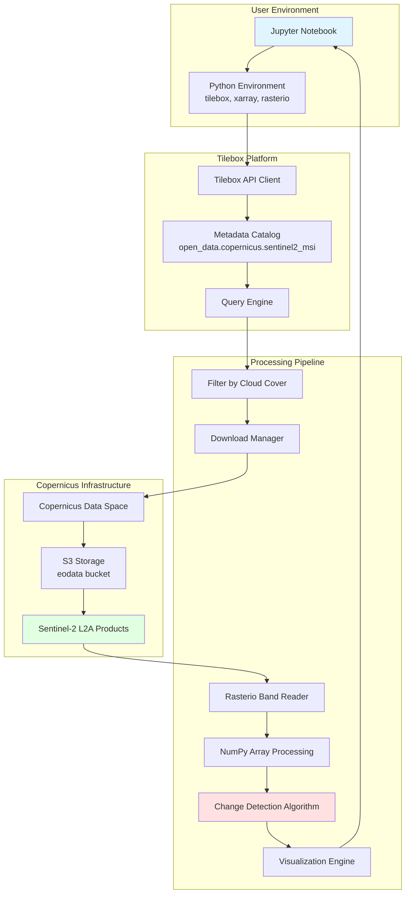
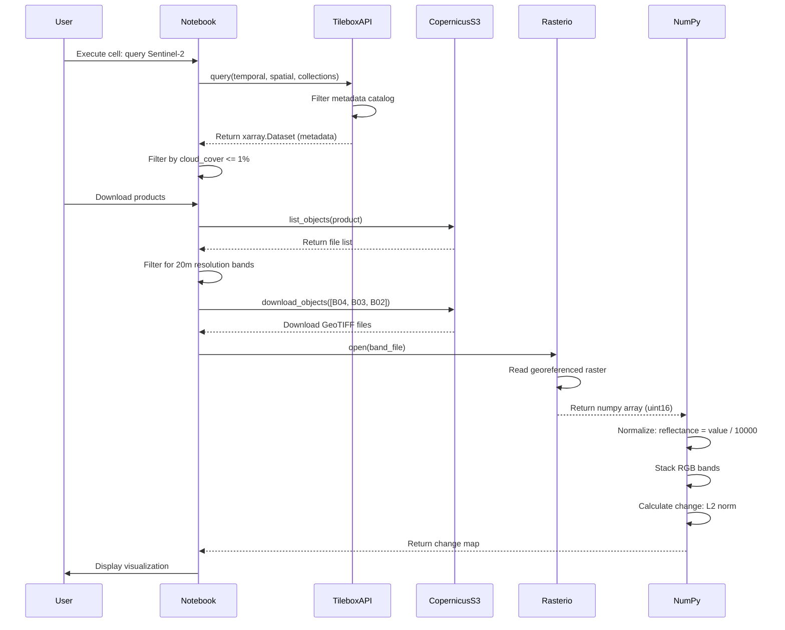
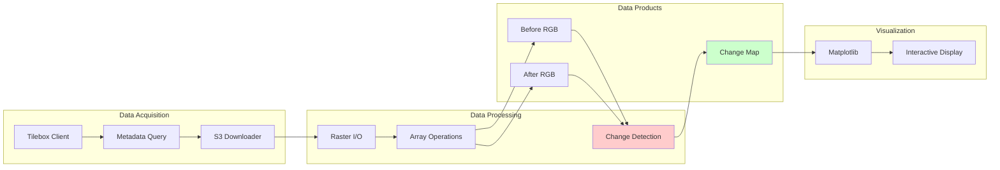
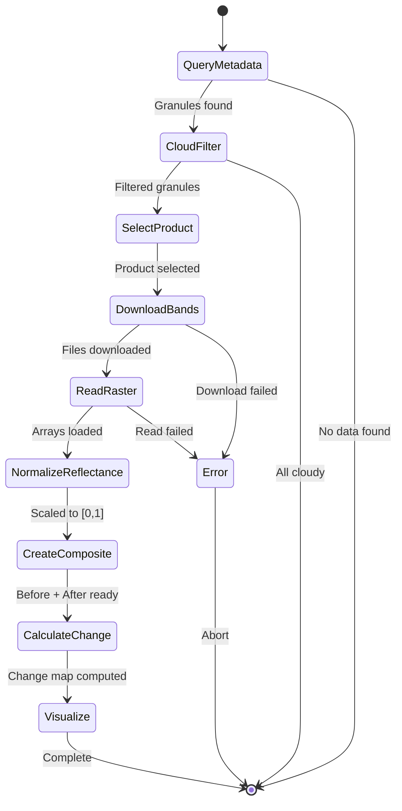
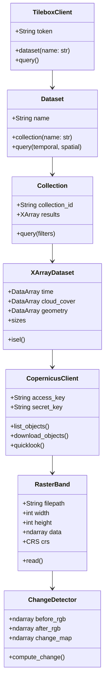
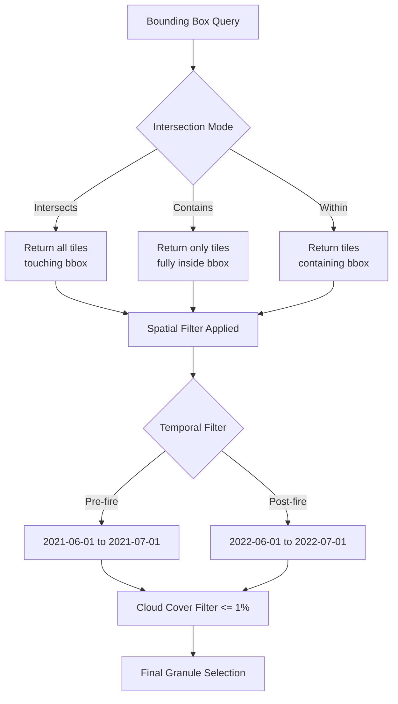
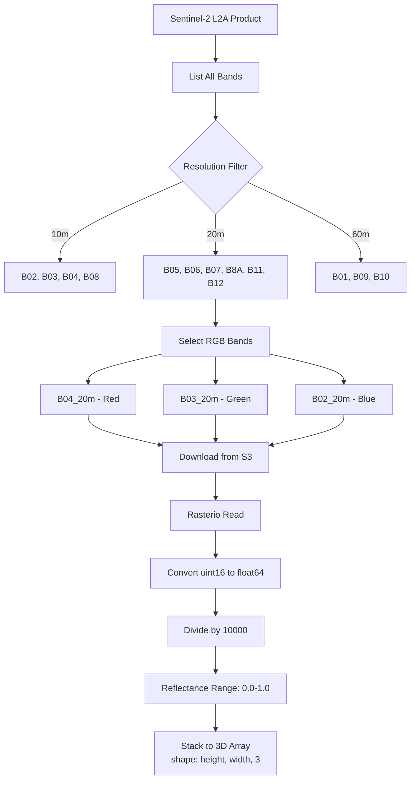
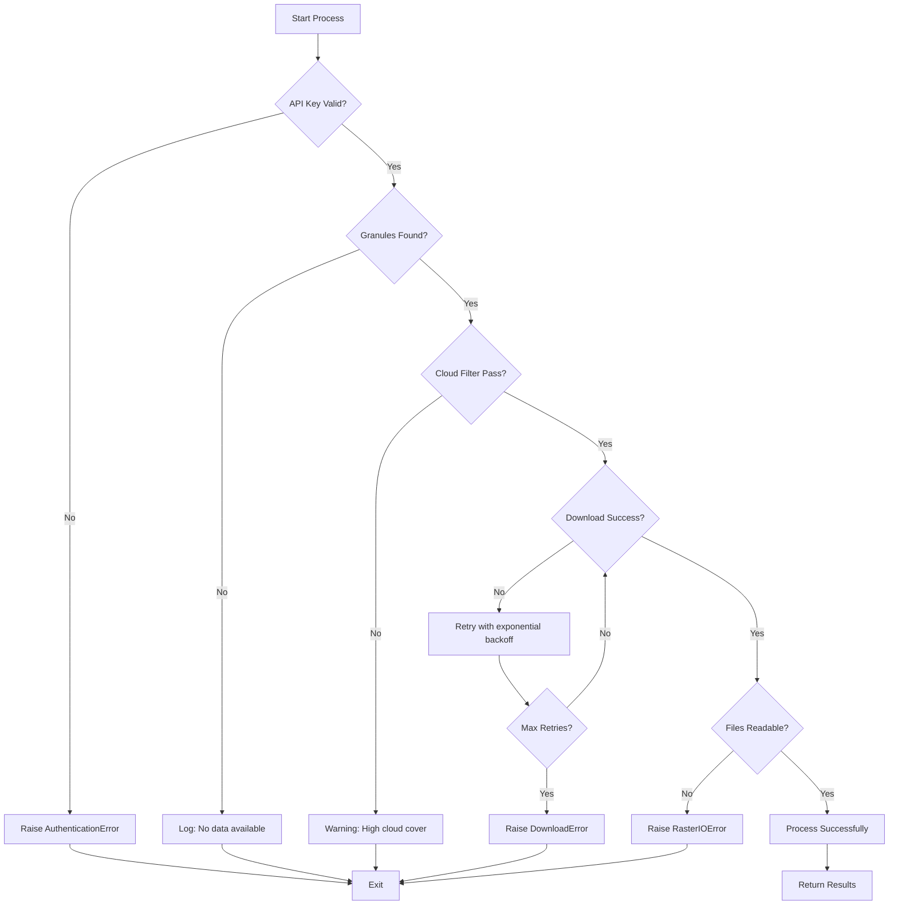

# Earth Observation System Architecture Diagrams
# Author: Thomas Fischer (TFITConsult)
# Version: 1.0
# Filename: eo_diagrams.md
# Pathname: /home/claude/eo_diagrams.md
# Purpose: Complete system architecture visualization for EO change detection workflow

## System Architecture Diagram

## Data Flow Sequence Diagram

## Component Interaction Diagram

## Processing Pipeline State Machine

## Data Model Class Diagram

## Spatial Query Visualization

## Band Processing Workflow

## Error Handling Flow

