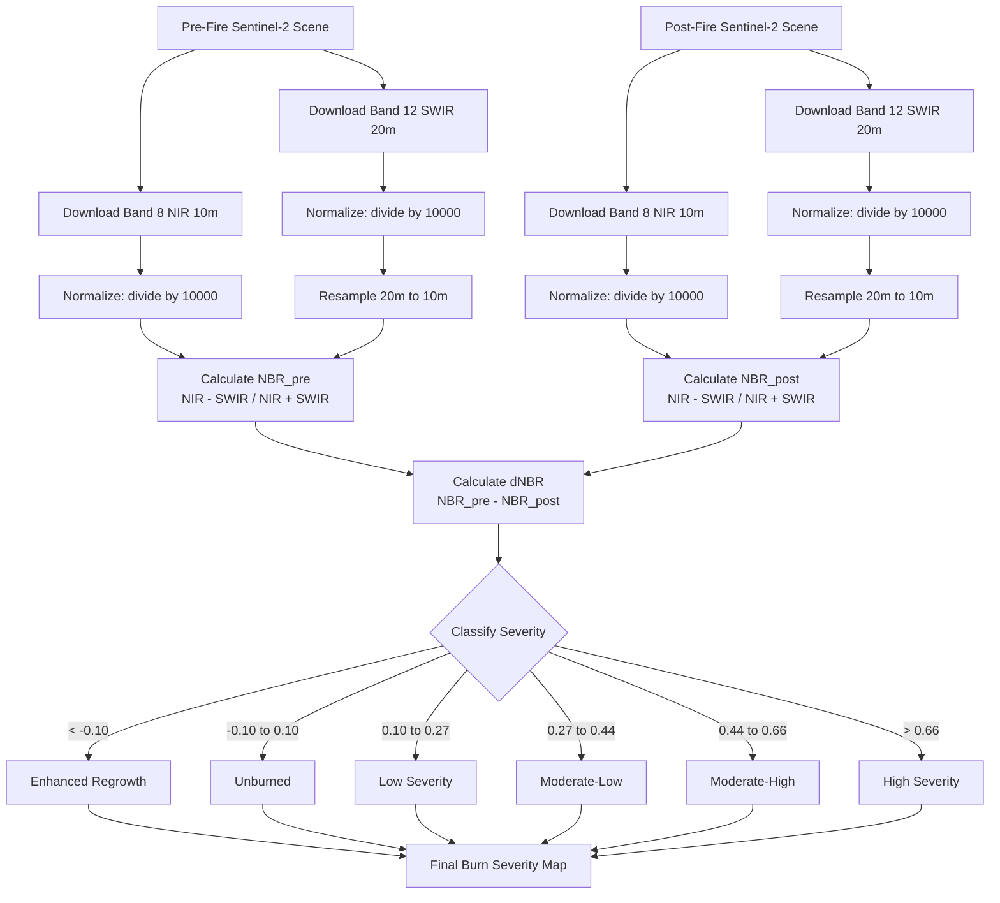

# ESA Data Access & NBR Calculation Guide
# Author: Thomas Fischer (TFITConsult)
# Version: 1.0
# Filename: esa_data_access_nbr_guide.md
# Pathname: /home/claude/esa_data_access_nbr_guide.md
# Purpose: Complete guide for accessing real ESA Sentinel data and implementing NBR/dNBR calculation

## Part 1: Accessing Real ESA Sentinel Data

### Option 1: Copernicus Data Space Ecosystem (Recommended)

The **Copernicus Data Space** is the official ESA platform replacing the deprecated Copernicus Open Access Hub.

#### Step 1: Account Creation
```
URL: https://dataspace.copernicus.eu/
1. Click "Register"
2. Fill in required information
3. Verify email address
4. Login to your account
```

#### Step 2: Generate S3 Credentials
```
1. Navigate to: https://eodata-s3keysmanager.dataspace.copernicus.eu/
2. Login with your Copernicus credentials
3. Click "Create New Key Pair"
4. Save both:
   - Access Key ID
   - Secret Access Key
```

#### Step 3: Using the Credentials (Python)
```python
from tilebox.storage import CopernicusStorageClient

# Initialize client with your credentials
storage_client = CopernicusStorageClient(
    access_key="YOUR_ACCESS_KEY_ID",
    secret_access_key="YOUR_SECRET_ACCESS_KEY"
)

# Use with Tilebox or direct S3 access
```

#### Alternative: Direct S3 Access with boto3
```python
import boto3

s3_client = boto3.client(
    's3',
    aws_access_key_id='YOUR_ACCESS_KEY_ID',
    aws_secret_access_key='YOUR_SECRET_ACCESS_KEY',
    endpoint_url='https://eodata.dataspace.copernicus.eu'
)

# List buckets
response = s3_client.list_buckets()
print(response['Buckets'])
```

### Option 2: Using Tilebox Platform

Tilebox provides a simplified Python interface for Copernicus data.

#### Step 1: Get Tilebox API Key
```
1. Visit: https://console.tilebox.com/
2. Create free account
3. Navigate to: Account > API Keys
4. Click "Create New API Key"
5. Copy the generated key
```

#### Step 2: Implementation
```python
from tilebox.datasets import Client
from shapely.geometry import shape
import xarray as xr

# Initialize client
client = Client(token="YOUR_TILEBOX_API_KEY")

# Access Sentinel-2 dataset
sentinel2 = client.dataset("open_data.copernicus.sentinel2_msi")

# Define area of interest (example: Berlin)
aoi = shape({
    "type": "Polygon",
    "coordinates": [[
        [13.088, 52.338],
        [13.088, 52.675],
        [13.761, 52.675],
        [13.761, 52.338],
        [13.088, 52.338]
    ]]
})

# Query for data
results = sentinel2.collection("S2A_S2MSI2A").query(
    temporal_extent=("2024-06-01", "2024-08-31"),
    spatial_extent={"geometry": aoi, "mode": "intersects"}
)

# Filter by cloud cover
clear_scenes = results.isel(time=results.cloud_cover <= 10)
print(f"Found {clear_scenes.sizes['time']} scenes with <10% cloud cover")
```

### Option 3: Google Earth Engine

GEE provides access to Sentinel data through their JavaScript or Python API.

#### Setup
```python
import ee

# Initialize (requires authentication first time)
ee.Authenticate()  # Opens browser for authentication
ee.Initialize()

# Define area of interest
aoi = ee.Geometry.Rectangle([13.088, 52.338, 13.761, 52.675])

# Load Sentinel-2 Surface Reflectance
sentinel2 = ee.ImageCollection('COPERNICUS/S2_SR_HARMONIZED') \
    .filterBounds(aoi) \
    .filterDate('2024-06-01', '2024-08-31') \
    .filter(ee.Filter.lt('CLOUDY_PIXEL_PERCENTAGE', 10))

# Get image count
count = sentinel2.size().getInfo()
print(f"Found {count} images")

# Get first image
image = sentinel2.first()

# Export to Google Drive or download
```

### Option 4: SentinelHub API

Commercial API with free tier (requires credit card for free tier).

#### Setup
```python
from sentinelhub import (
    SHConfig,
    BBox,
    CRS,
    DataCollection,
    SentinelHubRequest,
    MimeType,
)

# Configuration
config = SHConfig()
config.sh_client_id = 'YOUR_CLIENT_ID'
config.sh_client_secret = 'YOUR_CLIENT_SECRET'

# Define request
bbox = BBox(bbox=[13.088, 52.338, 13.761, 52.675], crs=CRS.WGS84)

request = SentinelHubRequest(
    data_folder='./data',
    evalscript="""
    //VERSION=3
    function setup() {
        return {
            input: ["B04", "B03", "B02"],
            output: { bands: 3 }
        }
    }
    function evaluatePixel(sample) {
        return [sample.B04, sample.B03, sample.B02]
    }
    """,
    input_data=[
        SentinelHubRequest.input_data(
            data_collection=DataCollection.SENTINEL2_L2A,
            time_interval=('2024-06-01', '2024-08-31'),
        )
    ],
    responses=[
        SentinelHubRequest.output_response('default', MimeType.TIFF)
    ],
    bbox=bbox,
    size=[512, 512],
    config=config
)

# Execute
data = request.get_data()
```

## Part 2: NBR and dNBR Calculation

### Understanding NBR (Normalized Burn Ratio)

**Formula**:
```
NBR = (NIR - SWIR) / (NIR + SWIR)
```

For Sentinel-2:
```
NBR = (Band 8 - Band 12) / (Band 8 + Band 12)
```

Where:
- **Band 8 (NIR)**: Near-Infrared, 842 nm, 10m resolution
- **Band 12 (SWIR2)**: Short-Wave Infrared, 2190 nm, 20m resolution

### Physical Basis

**Healthy Vegetation**:
- High NIR reflectance (~50%)
- Low SWIR reflectance (~10%)
- NBR ≈ 0.66

**Burned Area**:
- Low NIR reflectance (~10%)
- High SWIR reflectance (~40%)
- NBR ≈ -0.60

### Implementation: NBR Calculation

#### Method 1: Using Tilebox/Rasterio

```python
"""
Author: Thomas Fischer (TFITConsult)
Version: 1.0
What this file does: Calculate NBR from Sentinel-2 bands
Filename: calculate_nbr.py
Pathname: /home/claude/calculate_nbr.py
"""

import rasterio
import numpy as np
from pathlib import Path

def calculate_nbr(nir_path: Path, swir_path: Path) -> np.ndarray:
    """
    Calculate Normalized Burn Ratio from NIR and SWIR bands.
    
    Args:
        nir_path: Path to Band 8 (NIR) GeoTIFF
        swir_path: Path to Band 12 (SWIR2) GeoTIFF
        
    Returns:
        NBR as numpy array with values in range [-1, 1]
    """
    # Read NIR band (Band 8 - 10m resolution)
    with rasterio.open(nir_path) as src:
        nir = src.read(1).astype(float)
        nir_profile = src.profile
        
    # Read SWIR band (Band 12 - 20m resolution)
    with rasterio.open(swir_path) as src:
        swir = src.read(1).astype(float)
        
    # Sentinel-2 L2A reflectance scaling factor
    nir = nir / 10000.0
    swir = swir / 10000.0
    
    # Calculate NBR with safe division
    # Avoid division by zero
    denominator = nir + swir
    nbr = np.where(
        denominator != 0,
        (nir - swir) / denominator,
        0  # Set to 0 where denominator is 0
    )
    
    return nbr, nir_profile


def resample_to_match(source_array: np.ndarray, 
                      target_shape: tuple) -> np.ndarray:
    """
    Resample array to match target shape (for 10m/20m alignment).
    
    Args:
        source_array: Array to resample (e.g., 20m SWIR)
        target_shape: Target shape (e.g., 10m NIR shape)
        
    Returns:
        Resampled array
    """
    from scipy.ndimage import zoom
    
    zoom_factors = (
        target_shape[0] / source_array.shape[0],
        target_shape[1] / source_array.shape[1]
    )
    
    return zoom(source_array, zoom_factors, order=1)


# Example usage
if __name__ == "__main__":
    # Paths to downloaded Sentinel-2 bands
    nir_band = Path("./data/before/B08_10m.tif")
    swir_band = Path("./data/before/B12_20m.tif")
    
    # Calculate NBR
    nbr, profile = calculate_nbr(nir_band, swir_band)
    
    # Save NBR as GeoTIFF
    profile.update(dtype=rasterio.float32, count=1)
    
    with rasterio.open("./data/nbr_before.tif", 'w', **profile) as dst:
        dst.write(nbr.astype(rasterio.float32), 1)
    
    print(f"NBR calculated: min={nbr.min():.3f}, max={nbr.max():.3f}")
```

#### Method 2: Complete Workflow with dNBR

```python
"""
Author: Thomas Fischer (TFITConsult)
Version: 1.0
What this file does: Calculate dNBR (delta NBR) for burn severity mapping
Filename: calculate_dnbr.py
Pathname: /home/claude/calculate_dnbr.py
"""

import rasterio
import numpy as np
import matplotlib.pyplot as plt
from pathlib import Path
from typing import Tuple


def download_bands_for_nbr(product_path: Path, 
                           storage_client,
                           product_metadata) -> Tuple[Path, Path]:
    """
    Download necessary bands for NBR calculation.
    
    Args:
        product_path: Path to save downloaded bands
        storage_client: Copernicus storage client
        product_metadata: Product metadata from query
        
    Returns:
        Tuple of (NIR_path, SWIR_path)
    """
    # List all files in product
    files = storage_client.list_objects(product_metadata)
    
    # Find Band 8 (NIR) at 10m
    nir_file = [f for f in files if "B08" in f and "10m" in f][0]
    
    # Find Band 12 (SWIR2) at 20m
    swir_file = [f for f in files if "B12" in f and "20m" in f][0]
    
    # Download
    downloaded_path = storage_client.download_objects(
        product_metadata,
        [nir_file, swir_file]
    )
    
    return (
        downloaded_path / nir_file,
        downloaded_path / swir_file
    )


def align_and_calculate_nbr(nir_path: Path, 
                            swir_path: Path) -> np.ndarray:
    """
    Align 10m and 20m bands and calculate NBR.
    
    Args:
        nir_path: Path to 10m NIR band
        swir_path: Path to 20m SWIR band
        
    Returns:
        NBR array at 10m resolution
    """
    from scipy.ndimage import zoom
    
    # Read NIR at 10m (reference resolution)
    with rasterio.open(nir_path) as src:
        nir = src.read(1).astype(float) / 10000.0
        profile = src.profile
        target_shape = nir.shape
    
    # Read SWIR at 20m
    with rasterio.open(swir_path) as src:
        swir = src.read(1).astype(float) / 10000.0
    
    # Resample SWIR from 20m to 10m
    zoom_factor = 2.0  # 20m -> 10m is 2x upsampling
    swir_10m = zoom(swir, zoom_factor, order=1)  # Bilinear interpolation
    
    # Ensure exact shape match (handle rounding)
    if swir_10m.shape != target_shape:
        swir_10m = swir_10m[:target_shape[0], :target_shape[1]]
    
    # Calculate NBR
    denominator = nir + swir_10m
    nbr = np.where(
        denominator != 0,
        (nir - swir_10m) / denominator,
        0
    )
    
    return nbr, profile


def calculate_dnbr(nbr_pre: np.ndarray, 
                   nbr_post: np.ndarray) -> np.ndarray:
    """
    Calculate dNBR (delta Normalized Burn Ratio).
    
    Args:
        nbr_pre: NBR before fire event
        nbr_post: NBR after fire event
        
    Returns:
        dNBR array
    """
    return nbr_pre - nbr_post


def classify_burn_severity(dnbr: np.ndarray) -> np.ndarray:
    """
    Classify burn severity based on dNBR values.
    
    Classification (USGS standard):
    - Enhanced Regrowth: < -0.10
    - Unburned: -0.10 to +0.10
    - Low Severity: +0.10 to +0.27
    - Moderate-Low: +0.27 to +0.44
    - Moderate-High: +0.44 to +0.66
    - High Severity: > +0.66
    
    Args:
        dnbr: dNBR array
        
    Returns:
        Classified array (0-6 integer values)
    """
    classified = np.zeros_like(dnbr, dtype=np.uint8)
    
    classified[dnbr < -0.10] = 0  # Enhanced regrowth
    classified[(dnbr >= -0.10) & (dnbr < 0.10)] = 1  # Unburned
    classified[(dnbr >= 0.10) & (dnbr < 0.27)] = 2  # Low severity
    classified[(dnbr >= 0.27) & (dnbr < 0.44)] = 3  # Moderate-low
    classified[(dnbr >= 0.44) & (dnbr < 0.66)] = 4  # Moderate-high
    classified[dnbr >= 0.66] = 5  # High severity
    
    return classified


def visualize_burn_analysis(nbr_pre: np.ndarray,
                           nbr_post: np.ndarray,
                           dnbr: np.ndarray,
                           severity_map: np.ndarray):
    """
    Create comprehensive visualization of burn analysis.
    
    Args:
        nbr_pre: Pre-fire NBR
        nbr_post: Post-fire NBR
        dnbr: Delta NBR
        severity_map: Classified severity
    """
    fig, axes = plt.subplots(2, 2, figsize=(16, 14))
    
    # NBR Pre-fire
    im1 = axes[0, 0].imshow(nbr_pre, cmap='RdYlGn', vmin=-1, vmax=1)
    axes[0, 0].set_title('NBR Pre-Fire\n(Green=Healthy, Red=Stressed)', 
                        fontsize=12, fontweight='bold')
    axes[0, 0].axis('off')
    plt.colorbar(im1, ax=axes[0, 0], fraction=0.046)
    
    # NBR Post-fire
    im2 = axes[0, 1].imshow(nbr_post, cmap='RdYlGn', vmin=-1, vmax=1)
    axes[0, 1].set_title('NBR Post-Fire', fontsize=12, fontweight='bold')
    axes[0, 1].axis('off')
    plt.colorbar(im2, ax=axes[0, 1], fraction=0.046)
    
    # dNBR
    im3 = axes[1, 0].imshow(dnbr, cmap='hot', vmin=-0.5, vmax=1.0)
    axes[1, 0].set_title('dNBR (Change Detection)\n(High=Severe Burn)', 
                        fontsize=12, fontweight='bold')
    axes[1, 0].axis('off')
    plt.colorbar(im3, ax=axes[1, 0], fraction=0.046)
    
    # Burn Severity Classification
    colors = ['darkgreen', 'green', 'yellow', 'orange', 'red', 'darkred']
    cmap = plt.matplotlib.colors.ListedColormap(colors)
    im4 = axes[1, 1].imshow(severity_map, cmap=cmap, vmin=0, vmax=5)
    axes[1, 1].set_title('Burn Severity Classification', 
                        fontsize=12, fontweight='bold')
    axes[1, 1].axis('off')
    
    # Custom legend
    from matplotlib.patches import Patch
    legend_elements = [
        Patch(facecolor='darkgreen', label='Enhanced Regrowth'),
        Patch(facecolor='green', label='Unburned'),
        Patch(facecolor='yellow', label='Low Severity'),
        Patch(facecolor='orange', label='Moderate-Low'),
        Patch(facecolor='red', label='Moderate-High'),
        Patch(facecolor='darkred', label='High Severity')
    ]
    axes[1, 1].legend(handles=legend_elements, loc='upper left',
                     bbox_to_anchor=(1.05, 1))
    
    plt.tight_layout()
    plt.savefig('./burn_analysis.png', dpi=300, bbox_inches='tight')
    plt.show()


# Complete workflow example
if __name__ == "__main__":
    from tilebox.datasets import Client
    from tilebox.storage import CopernicusStorageClient
    from shapely.geometry import shape
    
    # Initialize clients (use your actual keys)
    tilebox_client = Client(token="YOUR_TILEBOX_KEY")
    storage_client = CopernicusStorageClient(
        access_key="YOUR_S3_ACCESS_KEY",
        secret_access_key="YOUR_S3_SECRET_KEY"
    )
    
    # Define fire area
    fire_bbox = shape({
        "type": "Polygon",
        "coordinates": [[
            [-121.244, 40.045],
            [-121.244, 40.349],
            [-120.894, 40.349],
            [-120.894, 40.045],
            [-121.244, 40.045]
        ]]
    })
    
    # Query Sentinel-2 data
    s2 = tilebox_client.dataset("open_data.copernicus.sentinel2_msi")
    
    # Pre-fire
    pre_fire = s2.collection("S2A_S2MSI2A").query(
        temporal_extent=("2021-06-01", "2021-07-01"),
        spatial_extent={"geometry": fire_bbox, "mode": "intersects"}
    ).isel(time=0)  # Select first clear scene
    
    # Post-fire
    post_fire = s2.collection("S2A_S2MSI2A").query(
        temporal_extent=("2021-11-01", "2021-12-01"),
        spatial_extent={"geometry": fire_bbox, "mode": "intersects"}
    ).isel(time=0)
    
    # Download bands
    print("Downloading pre-fire bands...")
    nir_pre, swir_pre = download_bands_for_nbr(
        Path("./data/pre"), storage_client, pre_fire
    )
    
    print("Downloading post-fire bands...")
    nir_post, swir_post = download_bands_for_nbr(
        Path("./data/post"), storage_client, post_fire
    )
    
    # Calculate NBR
    print("Calculating NBR...")
    nbr_pre, profile = align_and_calculate_nbr(nir_pre, swir_pre)
    nbr_post, _ = align_and_calculate_nbr(nir_post, swir_post)
    
    # Calculate dNBR
    dnbr = calculate_dnbr(nbr_pre, nbr_post)
    
    # Classify severity
    severity = classify_burn_severity(dnbr)
    
    # Save results
    print("Saving results...")
    profile.update(dtype=rasterio.float32)
    
    with rasterio.open("./nbr_pre.tif", 'w', **profile) as dst:
        dst.write(nbr_pre.astype(np.float32), 1)
        
    with rasterio.open("./nbr_post.tif", 'w', **profile) as dst:
        dst.write(nbr_post.astype(np.float32), 1)
        
    with rasterio.open("./dnbr.tif", 'w', **profile) as dst:
        dst.write(dnbr.astype(np.float32), 1)
    
    profile.update(dtype=rasterio.uint8)
    with rasterio.open("./burn_severity.tif", 'w', **profile) as dst:
        dst.write(severity, 1)
    
    # Visualize
    print("Creating visualization...")
    visualize_burn_analysis(nbr_pre, nbr_post, dnbr, severity)
    
    # Statistics
    total_pixels = dnbr.size
    burned_pixels = np.sum(dnbr > 0.10)
    high_severity = np.sum(dnbr > 0.66)
    
    print(f"\nBurn Analysis Statistics:")
    print(f"Total area analyzed: {total_pixels * 100 / 1e6:.2f} km²")
    print(f"Burned area: {burned_pixels * 100 / 1e6:.2f} km² "
          f"({100*burned_pixels/total_pixels:.1f}%)")
    print(f"High severity: {high_severity * 100 / 1e6:.2f} km² "
          f"({100*high_severity/total_pixels:.1f}%)")
```

### Burn Severity Classification Reference

| dNBR Range | Severity Level | Description |
|-----------|---------------|-------------|
| < -0.10 | Enhanced Regrowth | Increased vegetation post-fire |
| -0.10 to +0.10 | Unburned | No significant change |
| +0.10 to +0.27 | Low Severity | Some vegetation damage |
| +0.27 to +0.44 | Moderate-Low | Moderate vegetation loss |
| +0.44 to +0.66 | Moderate-High | Significant vegetation loss |
| > +0.66 | High Severity | Complete vegetation destruction |

*Source: USGS FIREMON Landscape Assessment (LANDFIRE)*

## NBR Calculation Diagram



## Summary

This guide provides:
1. **Four methods** to access real Copernicus Sentinel data
2. **Complete Python implementation** of NBR/dNBR calculation
3. **Band alignment** handling for 10m/20m resolution difference
4. **Burn severity classification** using USGS standards
5. **Visualization functions** for comprehensive analysis

The code follows Python best practices with proper documentation headers as requested.
